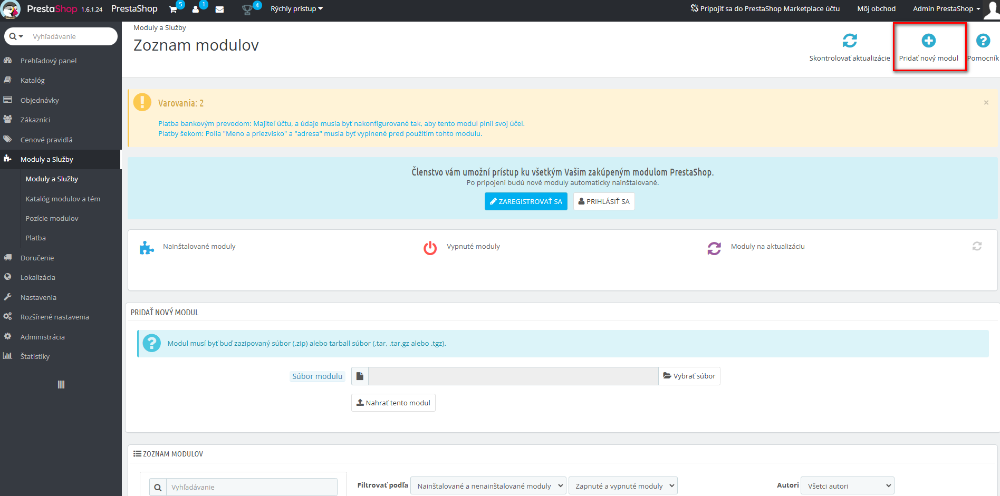
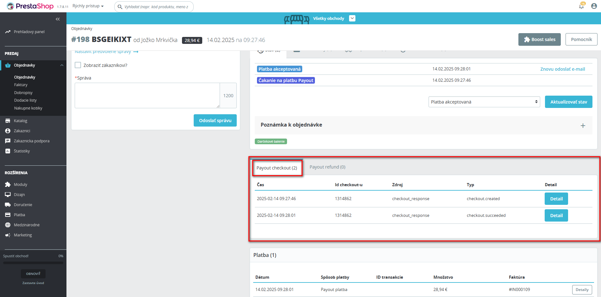

# Payout platobný modul

## Podporované prestashop verzie

1.6.1 - 8.x

## Podporované php verzie

php 7.1 a vyššie

## Závislosti

Zapnuté rozšírenie curl pre php.

## Podporované krajiny a meny

### Krajina v adrese doručenia musí byť jedna z podporovaných krajín aby bola Payout platba k dispozícii

| Krajina     | ISO 3166 Alpha-2 kód | ISO 3166 Alpha-3 kód | ISO 3166 numeric-3 Kód |
|-------------|----------------------|----------------------|------------------------|
| Rakúsko     | AT                   | AUT                  | 040                    |
| Belgicko    | BE                   | BEL                  | 056                    |
| Bulharsko   | BG                   | BGR                  | 100                    |
| Chorvátsko  | HR                   | HRV                  | 191                    |
| Cyprus      | CY                   | CYP                  | 196                    |
| Česko       | CZ                   | CZE                  | 203                    |
| Dánsko      | DK                   | DNK                  | 208                    |
| Estónsko    | EE                   | EST                  | 233                    |
| Fínsko      | FI                   | FIN                  | 246                    |
| Francúzsko  | FR                   | FRA                  | 250                    |
| Nemecko     | DE                   | DEU                  | 276                    |
| Grécko      | GR                   | GRC                  | 300                    |
| Maďarsko    | HU                   | HUN                  | 348                    |
| Írsko       | IE                   | IRL                  | 372                    |
| Taliansko   | IT                   | ITA                  | 380                    |
| Lotyšsko    | LV                   | LVA                  | 428                    |
| Litva       | LT                   | LTU                  | 440                    |
| Luxembursko | LU                   | LUX                  | 442                    |
| Malta       | MT                   | MLT                  | 470                    |
| Holandsko   | NL                   | NLD                  | 528                    |
| Poľsko      | PL                   | POL                  | 616                    |
| Portugalsko | PT                   | PRT                  | 620                    |
| Rumunsko    | RO                   | ROU                  | 642                    |
| Slovensko   | SK                   | SVK                  | 703                    |
| Slovinsko   | SI                   | SVN                  | 705                    |
| Španiesko   | ES                   | ESP                  | 724                    |
| Švédsko     | SE                   | SWE                  | 752                    |

### Zvolená mena musí byť jedna z podporovaných mien

| Mena            | ISO 4217 kód |
|-----------------|--------------|
| Euro            | EUR          |
| Česká koruna    | CZK          |
| Maďarský forint | HUF          |
| Poľský zlotý    | PLN          |
| Rumunský lei    | RON          |
| Bulharský lev   | BGN          |

## Inštalácia modulu

Pre inštaláciu modulu sú potrebné nasledujúce kroky:

### Prestashop 1.7, 8

1. V administrácii prestahop-u prejsť do sekcie `Moduly` -> `Manažér modulov`
   
2. Stlačiť tlačidlo `Nahrať modul`
   
3. Presunúť zip súbor modulu do obĺžnika na nahratie modulu
   
4. Po úspešnej inštalácii by ste mali vidieť okno s hláškou o úspechu a tlačidlom na nastavenie modulu
   

### Prestashop 1.6

1. V administrácii prestashop-u prejsť do sekcie `Moduly a služby`
   
2. Stlačiť tlačidlo `Pridať nový modul`
   
3. Vybrať súbor modulu stlačením tlačidla `Vybrať súbor` a potvrdiť stlačením tlačidla `Nahrať tento modul`
   
4. Inštalovať modul stlačením tlačidla `Inštalovať` pri module `Payout platba` v zozname modulov
   
5. V dialógovom okne stlačiť tlačidlo `Pokračovať s inštaláciou`
   
6. Následne by sa mala zobraziť stránka konfigurácie modulu a hláška `Modul(y) boli úspešne nainštalované.`
   

## Konfigurácia modulu

Pre konfiguráciu modulu je potrebné spraviť niekoľko krokov:

1. V payout administrácii si vytvoriť api kľúč a pri jeho vytváraní vyplniť notifikačnú adresu (notifikačná adresa je
   zobrazená v konfigurácii modulu)
   
2. Po vytvorení api kľúča je v konfigurácii modulu potrebné:
    - v prípade testovacieho api kľúča zapnúť prepínačom Sandbox mód
    - v prípade produkčného api kľúča vypnúť prepínačom Sandbox mód
    - zadať klientsky kľúč a tajomstvo

   
3. Skontrolovať vyplnené údaje
    - Stlačením tlačidla `Skontrolovať vyplnené údaje`, sa overí platnosť zadaných údajov
        - V prípade úspechu sa zobrazí hláška `Údaje sú platné`
        - V prípade neúspešného overenia sa zobrazí
          hláška `Údaje neboli overené, dôvod: (správa o konkrétnom probléme, ktorá prišla v odpovedi)`
        - Po úspešnom overení, môžeme údaje uložiť - stlačiť tlačidlo `Uložiť`

   
4. Skontrolovať výsledok uloženia
    - V prípade úspešného uloženia sa zobrazí hláška `Nastavenia boli úspešne uložené`
      
    - V prípade neúspešného uloženia sa zobrazí chybová hláška s popisom
      

> **Upozornenie**: Pri zadaní nesprávnych údajov api kľúča, nebude modul správne fungovať. Dbajte preto na správne
> zadanie údajov a následne otestovanie funkčnosti.

## Administrátorské rozhranie

### Detail objednávky

#### Tabuľka payout logov

V detaile objednávky je k dispozícii prehľad payout logov vo forme tabuľky.

V prestashop 1.7 a 8 je umiestnená takto:

V prestashop 1.6 je umiestnená takto:

Tabuľka obsahuje nasledujúce stĺpce:

- Čas - čas vytvorenia logu
- Id checkout-u - id checkout-u v payout systéme
- Zdroj - na základe dát akej udalosti bol log zapísaný, dva možné zdroje:
    - checkout_response - log sa zapísal po vytvorení checkout-u alebo po zmene stavu objednávky na základe odpovede pre
      dotaz na payout api
    - webhook - log sa zapísal na základe prijatej požiadavky zo strany payout
- Typ - typ udalosti - stavy checkout-u, môžu byť tri možné typy:
    - checkout.created - checkout bol vytvorený v systéme payout
    - checkout.succeeded - checkout bol úspešný
    - checkout.expired - checkout expiroval
- Detail
    - po kliknutí na modré tlačidlo `Detail` sa otvorí okno s detailom logu
    - v detaile je okrem údajov z tabuľky, k dispozícii detail zdrojových dát udalosti, na základe ktorých bol log
      vytvorený

  

#### Stavy objednávky

Pre objednávku vytvorenú so zvolenou payout platobnou možnosťou, existujú tri základné stavy objednávky:

1. `Čakanie na platbu Payout`
    - stav sa nastaví automaticky po vytvorení objednávky
    - objednávku je možné zaplatiť
2. `Platba akceptovaná` - stav sa nastaví po potvrdení úspešného checkout-u prostredníctvom webhook-u prípadne
   prostredníctvom odpovede pre dotaz na payout api
   
3. `Expirovaná Payout platba`
    - stav sa nastaví po potvrdení expirovaného checkout-u prostredníctvom webhook-u prípadne
      prostredníctvom odpovede pre dotaz na payout api
    - objednávku nie je možné už zaplatiť, je ale možné že zaplatená už bola a je potrebné počkať na potvrdenie o
      prijatí platby
    - stav sa stále môže zmeniť na `Platba akceptovaná`

   

### Prestashop logy

- Modul v prípade chýb alebo potreby upozornenia loguje do prestashop log tabuľky
- K prestashop logom je možné pristupovať prostredníctvom sekcie
  administrácie `Rozšírené nastavenia` -> `Záznamy aktivity`
- Všetky payout logy majú prefix v tvare [Payout] a je ich možné podľa toho filtrovať

